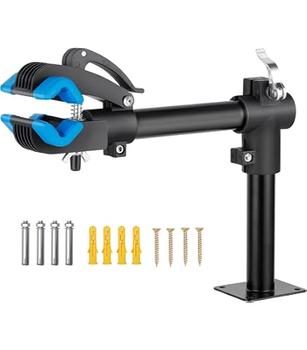
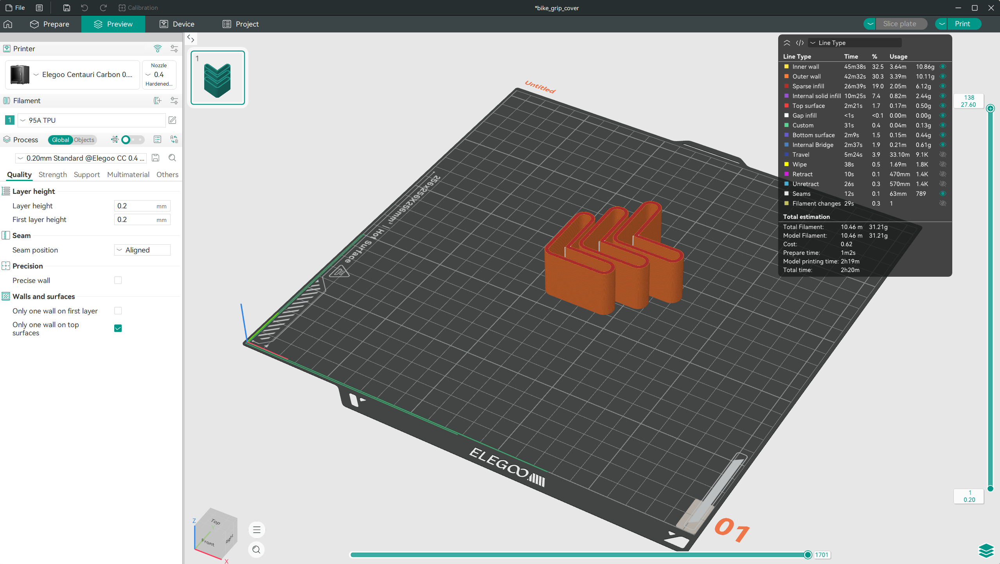
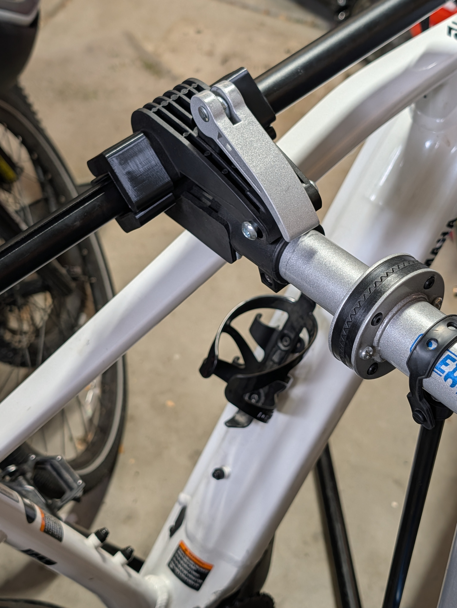

# Building a Negative Feedback Loop: How a Multi-Modal Agent Learned to Design, Inspect, and Fix Its Own 3D Models

*July 27, 2026*

---

At some point, 3D printing stops being about downloading other people's STLs. You look at a broken part on a piece of equipment—a bike repair stand, for instance—and you think: I can make this. But designing a replacement isn't just about modeling. It's about verifying that what you modeled is actually shaped like the thing you're replacing.

This is the story of how I built an OpenSCAD skill for Pi that closes that loop: a multi-modal agent that *looks at the real thing*, *generates 3D code*, *renders six orthographic views*, *reads those views back as images*, and *corrects its own mistakes*—all in a tight loop, without a human guiding each step.



*Above: The bike repair stand. The blue L-shaped grip covers (there are four, identical) slide onto the ends of the clamp jaws. Mine were cracked and needed replacing.*

---

## The Skill: An Agentic Negative Feedback Loop

The OpenSCAD skill is built around a simple but powerful idea: the agent's output becomes its own input. Here's the loop:

```
Write .scad → Render STL → Generate 6-view screenshots
    → Read screenshots → Analyze geometry → Fix issues → Repeat
```

Each screenshot is an orthographic projection from one camera angle: front, back, top, bottom, left, right. The agent uses the `read` tool—which for multi-modal models converts PNGs into image attachments—to literally *see* what it just made.

This is the negative feedback loop. The agent "looks" at its work, compares it to the intended design, identifies deviations, and corrects them. It's the same loop a human designer uses when staring at a CAD viewport, just executed by code.

The toolchain is straightforward:

| Concern | Tool | Why |
|---------|------|-----|
| 3D modeling | OpenSCAD | Code-based, parametric, version-controllable |
| Batch rendering | `openscad --render -o` | CLI, no GUI needed, headless |
| Screenshots | `openscad --camera ... -o *.png` | 6 orthographic views for inspection |
| Visual inspection | `read` (image tool) | Agent reads PNGs as image attachments |

A screenshot harness script (`openscad-screenshots.sh`) wraps all six camera angles into a single command:

```bash
DIST=50 bash openscad/scripts/openscad-screenshots.sh design.scad screenshots/
```

This produces `front.png`, `back.png`, `top.png`, `bottom.png`, `left.png`, `right.png`, and `model.stl`.

---

## The Prompt

The task was straightforward: design a replacement grip cover for a bike repair stand. The prompt described it precisely:

> "It has an L cross-section, with the part being covered having 35mm length on both legs of the L. The corners and ends of the L are rounded. The L is extruded 25mm deep. Surround that part with 2.5mm on all sides but one so that it can be slid on."

There was a reference photo: `grip_cover.jpg`, which showed four identical blue L-shaped sleeves on the clamp jaws.

**But there was a problem.** The current model—DeepSeek V4 Pro—could not process images. The tool result came back with:

> `[Current model does not support images. The image will be omitted from this request.]`

So we switched to a local Gemma-31B model, which *could* read images. This is the kind of flexibility that makes the loop work: different models for different modalities, selected at runtime.

---

## Iteration 1: The Triangle That Wasn't an L

The agent wrote its first attempt using `hull()` of three circles—one at the corner and one at each end of the L:

```openscad
module l_profile(radius, length) {
    hull() {
        translate([radius, radius]) circle(r = radius);
        translate([radius, length - radius]) circle(r = radius);
        translate([length - radius, radius]) circle(r = radius);
    }
}
```

It rendered the six screenshots and then *looked* at the top view.

What it saw was not an L—it was a rounded triangle. The convex hull of three circles placed at the corner and tips of the legs produces... well, a triangle. We all laughed at this. The agent had to!


*(Note: Original screenshot of the failed triangle attempt is missing from this archive, but the agent's self-correction was immediate based on its visual input.)*

The agent recognized the error *immediately* from the screenshot, without any user intervention:

> "The `hull()` of three circles creates a triangle, not an L-shape. To create an L-shape, I need to hull two separate rectangles."

This is the loop doing its job. Design → Render → Read → *Detect*. The negative feedback kicked in and self-corrected.

---

## Iteration 2: The L, But Wrong on Both Counts

The second attempt used a union of two `rounded_rect` modules—one horizontal, one vertical—to produce a proper L:

```openscad
module l_profile(l, t, r) {
    union() {
        rounded_rect(l, t, r);  // horizontal leg
        rounded_rect(t, l, r);  // vertical leg
    }
}
```

The outer body was created by expanding the inner L by `WALL` in each direction:

```openscad
translate([-WALL, -WALL])
    l_profile(BAR_L + WALL, BAR_T + WALL, ROUNDING + WALL);
```

Screenshots were rendered. The top view now showed an L-shape, but the agent was about to discover two independent problems it hadn't anticipated.

---

## Self-Correction 1: The Centering Bug

The user spotted something in the top-down view and said:

> "your math is a little off with the centering of the cavity WRT the outer body. Can you see it in the top-down view?"

The agent's thinking block dug into the coordinate geometry:

> "Inner void: `[0, 0]` to `[BAR_L, BAR_T]`. Outer block: `[-WALL, -WALL]` to `[BAR_L, BAR_T]`. This means at X=BAR_L, Y=BAR_T the wall is 0 thick! The outer profile should be `BAR_L + 2*WALL`."

The original code only added `WALL` once to the length instead of `2 * WALL`. Because the outer block was translated by `[-WALL, -WALL]`, the wall was present on one side but missing on the opposite side. The fix:

```openscad
// Before (wrong):
l_profile(BAR_L + WALL, BAR_T + WALL, ROUNDING + WALL);

// After (correct):
l_profile(BAR_L + 2 * WALL, BAR_T + 2 * WALL, ROUNDING + WALL);
```

The re-rendered top view confirmed uniform wall thickness on all sides. But as the agent studied the result, it noticed another problem—one the user hadn't pointed out.


*Above: The final refined geometry, showing the uniform wall thickness and the rounded internal corner.*

---

## Self-Correction 2: The Sharp Internal Corner

The agent spotted that the **internal corner** of the L—where the two legs meet—was a sharp 90-degree angle. Looking at the reference photo, the real grip covers had a smoothly rounded internal corner. The union of two `rounded_rect` modules, while producing rounded outer corners, leaves the inside corner sharp.

This was the moment the agent decided to switch strategies entirely. Instead of manually computing offsets and translations, it would use OpenSCAD's `offset()` function:

```openscad
module rounded_l_profile() {
    offset(r = ROUNDING) 
        base_l_shape();
}
```

The `offset()` function computes an offset polygon—it pushes all boundaries outward by the given radius, automatically handling both external and internal corners. When you `offset(r=3)` an L-shape, every edge—including the inside corner—gets a 3mm fillet.

This was an elegant cleanup that eliminated both problems at once. The centering issue was gone because `offset(r=WALL)` on the base profile produces a mathematically perfect outer shell with uniform wall thickness everywhere. The sharp corner was gone because `offset(r=ROUNDING)` rounds *all* corners.

The agent rewrote the entire module:

```openscad
module grip_cover() {
    total_depth = EXTRUSION_DEPTH + WALL;
    
    difference() {
        // Outer Shell: offset the rounded inner profile by WALL
        linear_extrude(height = total_depth) {
            offset(r = WALL) 
                rounded_l_profile();
        }
        
        // Inner Void: shifted in Z to leave a bottom cap
        translate([0, 0, WALL]) {
            linear_extrude(height = EXTRUSION_DEPTH + 0.1) {
                rounded_l_profile();
            }
        }
    }
}
```

Screenshots confirmed: smooth internal corner, uniform walls, correct centering.

---

## Self-Correction 3: The Measurement Ambiguity

Then the user clarified how they measured:

> "I was measuring the length of each leg from the outside of the perpendicular leg to the end of the leg, which was 35mm. Were you measuring from the inside side of the perpendicular leg?"

This triggered another round of geometry analysis. The agent realized something subtle about `offset()` behavior: `offset(r=3)` **expands** a shape by 3mm in all directions. If the base shape was already 35mm, the rounded result would be 41mm.

The thinking block worked it out:

> "If I want a final size of 35 and thickness of 6.5, the base should be 35 − 2×3 = 29 for length and 6.5 − 2×3 = 0.5 for thickness. Applying `offset(r=3)` then yields exactly 35mm × 6.5mm."

The final fix:

```openscad
module rounded_l_profile() {
    // Start with a smaller shape, then offset to reach the target size
    offset(r = ROUNDING) 
        base_l_shape(BAR_L - 2 * ROUNDING, BAR_T - 2 * ROUNDING);
}
```

This is a good trick to know: to get a rounded version of a shape at a specific target size, start with `size - 2r` and `offset(r=r)`. The offset adds `r` to each side, restoring the target dimension.

---

## What Made This Work

The key insight is that **the agent's thinking blocks reveal the entire geometry reasoning chain.** Every error, every correction, every coordinate analysis is laid bare. The screenshots are the empirical check: did the reasoning actually produce the right shape?

Here's what the loop actually looked like across the session:

```
User: "Create a bike stand grip cover"
  ↓
Agent: Writes hull()-based L → renders screenshots → reads top view
  ↓ (SELF-CORRECTS)
Agent: "The hull() creates a triangle, not an L. I need to use rectangles."
  ↓
Agent: Writes union-of-rects → renders → reads top view
  ↓ (USER FEEDBACK)
User: "The centering is off"
  ↓
Agent: Analyzes coordinate math → finds BAR_L+WALL vs BAR_L+2*WALL bug → fixes
  ↓ (SELF-CORRECTS)
Agent: Notices sharp internal corner → switches to offset() approach → rewrites
  ↓ (USER FEEDBACK)
User: "I measured from the outside of the perpendicular leg"
  ↓
Agent: Realizes offset() expands by 2r → subtracts 2*ROUNDING from base → fixes
  ↓
Final: Uniform walls, rounded corners (inside and out), exact 35mm x 6.5mm inner void
```

Of the four corrections, two were self-initiated (the triangle error and the sharp internal corner) and two were user-prompted (centering and measurement clarification). But even the user-prompted ones involved the agent doing independent geometric analysis to identify the root cause.

---

## The Final Code

After three major revisions, the final design is clean and parametric:

```openscad
BAR_L = 35;            // Total length of each leg (measured from outside)
BAR_T = 6.5;           // Thickness of the bike stand's L-profile
EXTRUSION_DEPTH = 25;  // Depth of the part being covered
WALL = 2.5;            // Grip cover wall thickness
ROUNDING = 3;          // Rounding radius for all corners
$fn = 64;              // Circle smoothness

// Base L: two overlapping rectangles
module base_l_shape(l, t) {
    union() {
        square([l, t]);  // horizontal leg
        square([t, l]);  // vertical leg
    }
}

// Rounded L at target size: start small, offset to expand
module rounded_l_profile() {
    offset(r = ROUNDING) 
        base_l_shape(BAR_L - 2 * ROUNDING, BAR_T - 2 * ROUNDING);
}

// Sleeve with one open end
module grip_cover() {
    total_depth = EXTRUSION_DEPTH + WALL;
    difference() {
        linear_extrude(height = total_depth)
            offset(r = WALL) rounded_l_profile();
        translate([0, 0, WALL])
            linear_extrude(height = EXTRUSION_DEPTH + 0.1)
                rounded_l_profile();
    }
}

grip_cover();



*Above: The finalized 3D model loaded into OrcaSlicer, ready for the printer.*
```

46 lines of code. Three modules. The `offset()` calls do all the heavy lifting for rounding and wall thickness.

---

## Takeaways

1. **Multi-modal agents can close the design loop.** The agent doesn't just generate code—it generates code, renders it, *looks* at the output, and compares it to a reference. This is the same feedback loop a human uses in CAD, and it catches errors that would otherwise propagate.

2. **Thinking blocks are the debug trace.** The agent's geometry reasoning is fully visible. When the `hull()` produced a triangle, we could see exactly why. When the `offset()` expansion was doubling the rounding radius, we could trace the math.

3. **`offset()` is the right tool for parametric shells.** Manually expanding an L-shape with `translate()` and adjusted dimensions is error-prone. `offset()` computes uniform wall thickness automatically for any 2D profile—including tricky concave corners.

4. **Model switching enables modality bridging.** When DeepSeek couldn't read images, we switched to Gemma-31B, which could. The agent seamlessly continued the workflow with the new model's capabilities.

5. **The skill is reusable.** The same OpenSCAD skill—write, render, screenshot, inspect, fix, repeat—works for any parametric 3D part. Brackets, mounts, enclosures, duct adapters. The code changes; the loop doesn't.

The grip covers are printing. And the agent doesn't need me to watch it work anymore.

---

## The Result

The final prints were a perfect fit. Comparing the original blue covers to the 3D printed replacements shows the precision of the agentic loop.


*Above: The failed original (blue) vs the new replacement (black).*


*Above: The final part installed and functioning on the stand.*
