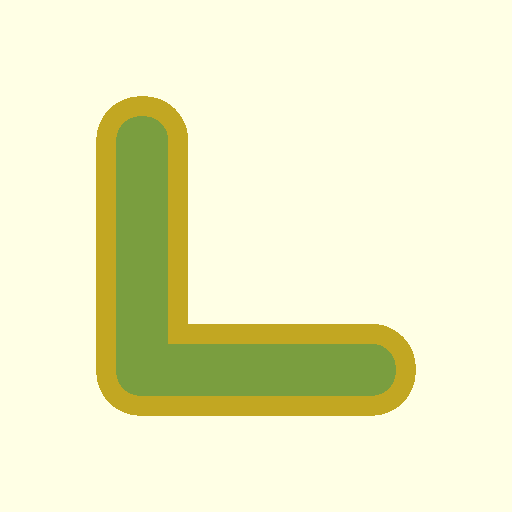

# The Design Loop: Closing the Gap Between AI and 3D Reality with OpenSCAD

_July 30, 2026_

---

If you do enough 3D printing, eventually you'll run into a need that's not met by downloading STLs. It could be a broken part on a piece of equipment such as a bike repair stand. If you're not a programmer or artist it can be daunting to turn your idea into a design. And designing a replacement isn't just about modeling; it's about verifying that what you modeled is actually shaped like the thing you're replacing.

This article is a write-up of how I built an OpenSCAD skill for [Pi.dev](https://pi.dev) that closes that loop: a multi-modal agent that _looks at the real thing_, _generates 3D code_, _renders multiple views_, _reads those views back as images_, and _corrects its own mistakes_—all in a tight loop, without a human guiding each step. With this skill and access to a local or remote model, you can design objects by providing descriptions and images to your agent.

---

## The Skill: An Agentic Negative Feedback Loop

The OpenSCAD skill is built around a simple but powerful idea: the agent's output becomes its own input. Here's the loop:

```
Write .scad → Render STL → Generate 2d renderings from multiple angles
    → Read screenshots → Analyze geometry → Fix issues → Repeat
```

Each screenshot is an orthographic or isometric projection from one camera angle: front, back, top, bottom, left, right and top-left and top-right. The agent uses the `read` tool—which converts PNGs into image attachments—to literally _see_ what it just made.

This is the **negative feedback loop**. The agent "looks" at its work, compares it to the intended design, identifies deviations, and corrects them. It's the same loop a human designer uses when staring at a CAD viewport, just executed by code.

---

## Case Study 1: The Bike Repair Stand Grip Cover

The task was to design a replacement grip cover for a bike repair stand. The prompt described it precisely:

> "It has an L cross-section, with the part being covered having 35mm length on both legs of the L. The corners and ends of the L are rounded. The L is extruded 25mm deep. Surround that part with 2.5mm on all sides but one so that it can be slid on."


### Iteration 1: The Triangle Error

The agent's first attempt used a `hull()` of three circles. It rendered the views and looked at the top-down screenshot. What it saw was not an L—it was a rounded triangle. The agent recognized the error _immediately_ from the screenshot:

> "The `hull()` of three circles creates a triangle, not an L-shape. To create an L-shape, I need to hull two separate rectangles."

### Iteration 2: The Centering and Corners

The second attempt produced an L, but the agent spotted a centering bug (the wall thickness wasn't uniform) and a sharp internal corner that didn't match the reference photo.

Instead of manual fixes, the agent switched to an elegant **offset strategy**:

1. Define the base L-shape.
2. Use `offset(r=ROUNDING)` to round _every_ corner (inside and out).
3. Use `offset(r=WALL)` to create a perfect outer shell.


_Above: The final refined geometry, showing uniform wall thickness and rounded corners._


_Above: The printed result (black) vs the original (blue). A perfect fit._


_Above: The final part installed and functioning on the stand._

---

## Case Study 2: Generative Detail (The Minecraft Creeper)

Once the basic feedback loop was proven, we pushed it further. Could the agent handle generative, high-fidelity geometry?

The agent was asked to design a Minecraft Creeper, but with a twist: "Sub-pixel surface detail." 

The initial prompt was simple:

> "Use the openscad skill to create a minecraft creeper 3d model. Find an image at `/mnt/c/Users/gladf/Downloads`. I just downloaded it."

After the basic geometry was solidified through a few iterations of the feedback loop, I asked for the generative detail:

> "Success! Now I want to simulate the pixelation of the model. There are 4 pixels in each whole number, so create a grid and assign random offsets to each pixel section on the body, except for the mouth and eyes in the face which should be uniformly recessed, which is scary looking. Don't do this for the bottom of the feet since a flat bottom is easier to print and no one can see the bottom typically anyway."

The agent wrote an OpenSCAD script that used a deterministic pseudo-random function to generate thousands of small cubes, each slightly offset to create a "noisy" or "glitchy" pixelated texture.

**The full history of this session, including all 101 user prompts across the Creeper, Turkey, and Bike Grip iterations, can be found in the [session logs README](../../examples/openscad/sessions/README.md).**


_Above: The Gemini 3 "Sub-Pixel Detail" Creeper. Every surface is composed of jittered voxels._

This demonstrates that the agent can reason about complex algorithmic geometry, not just simple primitives. Using **Gemini 3 Flash preview**, the agent used loops and functions to distribute detail across the model while maintaining the recognizable silhouette.

Notably, when we re-ran this task using **Gemma 4 31B** after improving the agent instructions in the SKILL.md file and optimizing our "fail fast" loop and script error handling, the open-weight model produced a pixelated version that was vastly superior to its initial attempts. It still wasn't quite as good as what the frontier model can do, but respectable.


_Above: The Gemma V2 result, proving that a robust feedback loop can bridge the performance gap between model scales._

---

## Case Study 3: Organic Forms (The Wild Turkey)

Can code-based CAD handle organic shapes? The "Wild Turkey" model proved it could. By combining spheres, cylinders, and polyhedra with hull operations and parametric offsets, the agent sculpted a surprisingly expressive model.


_Above: The Wild Turkey model, 3D printed in copper-color PLA. The faceted, "low-poly" look is a stylistic choice generated by the agent's use of hull operations on simplified primitives._

---

## Takeaways

1. **Multi-modal agents close the loop.** The agent doesn't just generate code; it _inspects_ the results. This catches errors (like the triangle-L) that a purely text-based model would never see.
2. **Thinking blocks are the debug trace.** Every geometric correction is backed by a visible reasoning chain in the agent's thought process.
3. **AIs are effective at OpenSCAD.** Because OpenSCAD is code, and because there are many examples on github and other public repos, models have a lot of internal knowledge. That's especially true for frontier models. OpenSCAD is versionable, parametric, and easily manipulated by LLMs.
4. **The "Fail Fast" Loop is Key.** Unlike human designers, agents don't get tired of fixing one bug at a time. By optimizing scripts to fail on the first error and return a clean "context-optimized" trace, we allow the agent to iterate rapidly without becoming overwhelmed by a cascade of secondary failures.
5. **The loop is reusable.** Whether it's a structural bike part, a generative character model, or an organic sculpture, the process remains the same: **Design → Render → See → Fix.**

Who would have guessed 3D printing would be a great use for agents?
