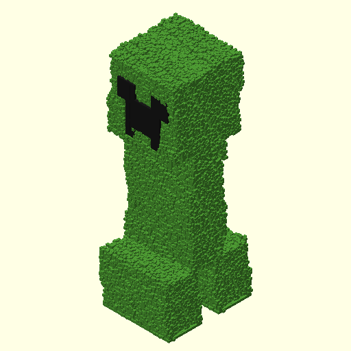
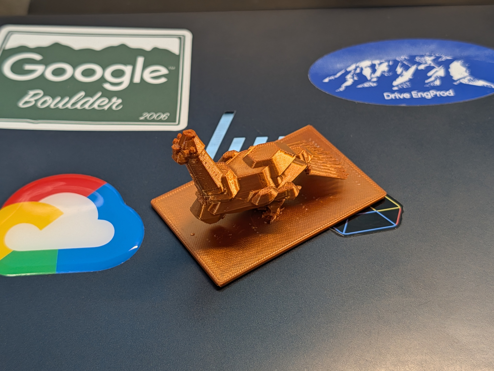
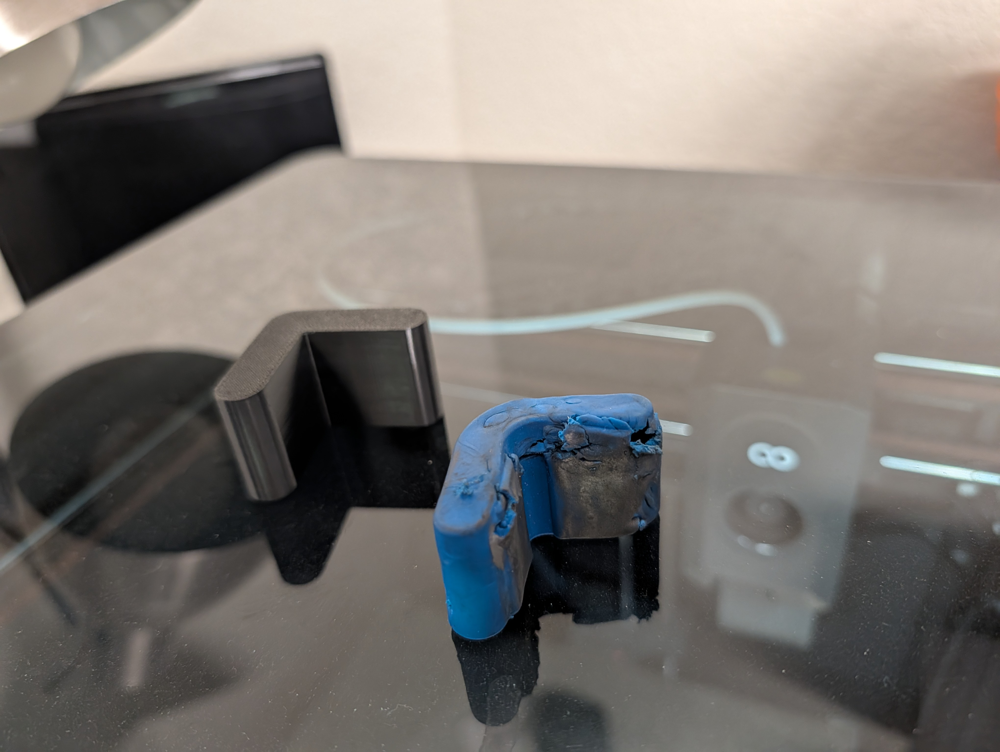

# Closing the Loop: Why Your AI Needs Eyes to Design in 3D

Most "AI-generated" 3D models today are one-shot wonders—fire a prompt into a specialized black-box model and hope the geometry isn't a non-manifold nightmare. But if you've ever tried to get a general-purpose LLM to write OpenSCAD code, you know the struggle. Large language models are notoriously bad at spatial reasoning; they’ll confidently tell you they’ve designed an L-bracket while handing you a rounded triangle.

_Above: This isn't a one-shot generation. It’s the result of an agentic negative feedback loop._

The problem isn't that LLMs can't code; it's that they can't _see_ what they're coding. To bridge this gap, I built an OpenSCAD skill for my Pi agent harness that creates a tight **negative feedback loop**:

1.  **Code**: The agent writes an OpenSCAD script.
2.  **Render**: A script executes OpenSCAD in the background to generate an STL.
3.  **See**: The tool captures six orthographic screenshots (front, back, top, bottom, left, right).
4.  **Analyze**: The agent "reads" these images back into its vision context.
5.  **Fix**: The agent compares the render to the user's intent and iterates.

### The Journey: From Gemma to Gemini 3 and Back

I started this experiment with an open-weight model (**Gemma 4 31B**). The results were... limited. It struggled to translate 2D reference images into 3D coordinates, often misplacing limbs or failing to understand depth.

_Above: Gemma's initial attempt (V1). Recognizable, but spatially confused._

I then scaled up to **Gemini 3 Flash preview**. Even with a model of that scale, it wasn't a "one-shot" victory. I had to identify performance bottlenecks—like OpenSCAD render times—and optimize the skill. I updated the script to leverage `openscad-nightly` with the `--backend=manifold` flag and improved the error reporting to be "context-optimized."

This "fail fast" philosophy was a game-changer: rather than trying to discover every error at once, the script was updated to exit on the very first failure, pass a clean exit code, and squelch irrelevant warnings. Humans get tired of fixing one bug at a time; agents don't. By allowing the agent to focus on fixing just the immediate roadblock, we kept the context clean and the iteration loop tight.

The result? The "Headline" model above—a high-fidelity, sub-pixelated Creeper where every surface is a jittered voxel grid.

**The real surprise came when I re-ran the Gemma model fresh.** While its base geometry was similar to the first pass, its ability to apply the complex pixelation detail was vastly superior. Armed with the improved script, better error handling, and refined skill instructions, the open-weight model produced a high-fidelity result in a fraction of the time with almost zero human intervention.

_Above: Gemma V2. By optimizing the skill rather than the model, the same open-weight 31B parameter model produced a vastly superior, high-fidelity result._

### Beyond the Pixel: Utility and Beauty

This loop isn't just for toys. It’s for real-world utility and organic beauty:

- **The Wild Turkey**: A low-poly, organic model that shows the agent can reason about complex hulls and primitives. Printed in copper-color PLA, it looks like a piece of art.
- **The Bike Repair Stand Grip**: I needed a replacement for a cracked rubber cover. The agent took a photo of the broken part, measured it via the vision loop, and iterated until the internal void and wall thickness were a perfect 1:1 match.

_Above: The Wild Turkey model, showing the agent's ability to handle organic, "low-poly" aesthetics._

_Above: The printed result (black) vs the original (blue). A perfect fit._

### How to Build Your Own Loop

I've packaged this entire workflow into a GitHub repository. It includes:

1.  The **OpenSCAD Skill**: The logic for rendering and screenshotting.
2.  The **Pi Harness Extension**: A tool for managing agent context (compaction) to keep iteration loops fast and token-efficient.

While many are looking at "multi-agent" architectures for complex tasks, I’ve found that a simple, tight loop—where the agent cleans up its own mess and passes refined instructions to its next "self"—is remarkably effective for 3D design.

**For a deeper dive into the specific geometric self-corrections and technical reasoning, check out the full technical paper here: [agentic-openscad.md](./agentic-openscad.md)**

**You can also view the full raw session prompts and iteration history in the [session logs README](../../examples/openscad/sessions/README.md).**

The future of AI-driven manufacturing isn't just better models; it's better loops.

**Check out the repo here: [https://github.com/gladfelter/agent_skills](https://github.com/gladfelter/agent_skills)**

---

**What’s the most "geometrically impossible" thing an AI has ever tried to hand you?** #3DPrinting #OpenSCAD #GenerativeAI #LLMs #GeminiAI #OpenSource
